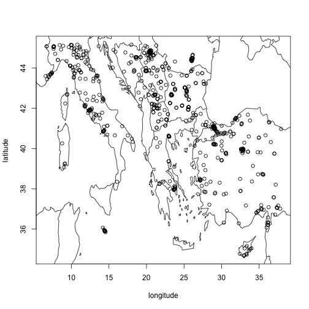

# Plotting

``` r
library(openaq)
```

The openaq package provides convenience functions to help plot data
extending the [`base::plot`](https://rdrr.io/r/base/plot.html) function.

To visualize locations on a map, call the `plot` function after
returning a data frame from the `list_locations` function call. A basic
basemap with national boundaries is included based on the [Natural Earth
dataset](https://www.naturalearthdata.com/) via the
[`maps`](https://cran.r-project.org/web/packages/maps/index.html)
package.

``` r
locations <- list_locations(
  bbox = c(xmin = 6.291990, ymin = 32.823129, xmax = 37.932615, ymax = 45.181129),
  parameters_id = 2,
  limit = 1000
)
```

``` r
plot(locations)
```



plot of chunk locations-map-plot

We can configure and customize the figure using standard
[`base::plot`](https://rdrr.io/r/base/plot.html) parameters in this
example coloring the points by provider and customizing the type of
marker used.

``` r
plot(locations, col = locations$providers_id, pch = 20)
```


Plot of locations, styled with color by providers_id

The `list_sensor_measurements` provides a
[`base::plot`](https://rdrr.io/r/base/plot.html) function to visualize
the measurement values as a time series line chart.

``` r
measurements <- list_sensor_measurements(
  3920,
  datetime_from = as.POSIXct("2025-01-01 00:00", tz = "America/Denver"),
  datetime_to = as.POSIXct("2025-01-15 23:00", tz = "America/Denver"),
)
```

``` r
plot(measurements)
```


Line chart of sensor measurements
