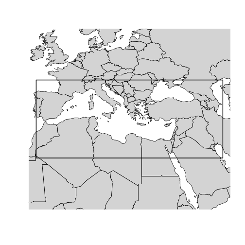
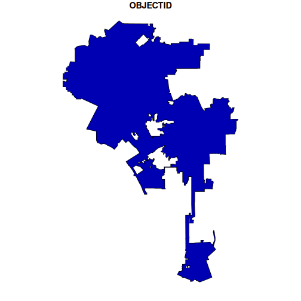
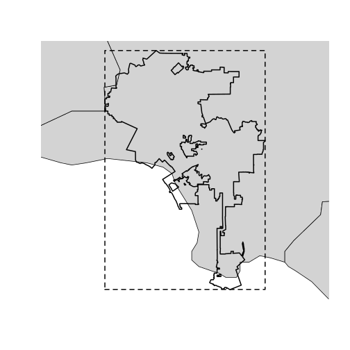
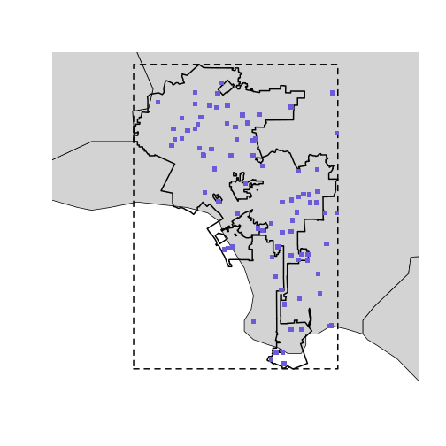

``` r
library(openaq)
library(sf)
library(maps)
```


The OpenAQ API has the ability to perform geospatial queries, enabling you to
retrieve data based on location. This vignette will guide you through the two
primary geospatial query methods available in `openaq`: point and radius
searches, and bounding box searches.

`openaq` provides access to two methods for querying locations on the OpenAQ
platform geospatially:

1. Point and Radius: Searches around a given point coordinate (latitude,
longitude) at a specified radius in meters.  This is ideal for finding air
quality data within a certain distance of a specific location.

2. Bounding Box: Searches within a spatial bounding box defined as a list of
four coordinates: `xmin`, `ymin`, `xmax`, and `ymax`. This method is useful for
querying data within a rectangular area.

## Point and Radius

The `list_location()` function allows you to search for locations near a given
point. You provide the latitude and longitude of the center point, as well as
the radius within which to search. The radius is specified in meters, with a
maximum value of 25,000 (25 kilometers).


``` r
locs <- list_locations(
  coordinates = c(latitude = -36.7724, longitude = -73.0666), # the coordinates in Concepción, Chile.
  radius = 25000 # 10,000 meters or 10 kilometers
)
head(locs)
#>    id              name is_mobile is_monitor         timezone countries_id
#> 1  26           Inpesca     FALSE       TRUE America/Santiago            3
#> 2  65          Punteras     FALSE       TRUE America/Santiago            3
#> 3  69  Kingston College     FALSE       TRUE America/Santiago            3
#> 4 210 Liceo Polivalente     FALSE       TRUE America/Santiago            3
#> 5 356          Bocatoma     FALSE       TRUE America/Santiago            3
#> 6 808            Indura     FALSE       TRUE America/Santiago            3
#>   country_name country_iso  latitude longitude      datetime_first
#> 1        Chile          CL -36.73720 -73.10443 2016-01-30 01:00:00
#> 2        Chile          CL -36.92333 -73.03613 2016-01-30 01:00:00
#> 3        Chile          CL -36.78465 -73.05206 2016-01-30 01:00:00
#> 4        Chile          CL -36.60171 -72.95852 2016-02-01 17:00:00
#> 5        Chile          CL -36.80303 -73.12053 2016-05-10 20:00:00
#> 6        Chile          CL -36.76980 -73.11371 2016-01-30 01:00:00
#>         datetime_last                        owner_name providers_id
#> 1 2026-03-09 18:00:00 Unknown Governmental Organization          164
#> 2 2026-03-09 18:00:00 Unknown Governmental Organization          164
#> 3 2026-03-09 18:00:00 Unknown Governmental Organization          164
#> 4 2026-03-09 18:00:00 Unknown Governmental Organization          164
#> 5 2026-03-09 18:00:00 Unknown Governmental Organization          164
#> 6 2026-03-09 18:00:00 Unknown Governmental Organization          164
#>   provider_name
#> 1 Chile - SINCA
#> 2 Chile - SINCA
#> 3 Chile - SINCA
#> 4 Chile - SINCA
#> 5 Chile - SINCA
#> 6 Chile - SINCA
```

In this example, we are searching for locations within a 10 kilometer radius of
the specified latitude and longitude. The result will be a list of locations
that fall within this circular area.

## Bounding box

For queries covering a rectangular area, you can use the `list_locations()`
function with the bbox argument. You need to provide the minimum and maximum
longitude (`xmin`, `xmax`) and latitude (`ymin`, `ymax`) values that define the
corners of your bounding box.


``` r
locs <- list_locations(
  bbox = c(
    xmin = -8.478184,
    ymin = 26.640174,
    xmax = 50.803066,
    ymax = 46.534067
  )
)
head(locs)
#>    id                         name is_mobile is_monitor        timezone
#> 1  34 SPARTAN - Weizmann Institute     FALSE       TRUE  Asia/Jerusalem
#> 2 420                    Vijećnica     FALSE       TRUE Europe/Sarajevo
#> 3 421                        Otoka     FALSE       TRUE Europe/Sarajevo
#> 4 422                       Tetovo     FALSE       TRUE Europe/Sarajevo
#> 5 423                   Ivan Sedlo     FALSE       TRUE Europe/Sarajevo
#> 6 584                      Harmani     FALSE       TRUE Europe/Sarajevo
#>   countries_id           country_name country_iso latitude longitude
#> 1           11                 Israel          IL   31.907    34.810
#> 2          132 Bosnia and Herzegovina          BA   43.859    18.435
#> 3          132 Bosnia and Herzegovina          BA   43.848    18.364
#> 4          132 Bosnia and Herzegovina          BA   44.290    17.895
#> 5          132 Bosnia and Herzegovina          BA   43.715    18.036
#> 6          132 Bosnia and Herzegovina          BA   44.916    17.349
#>   datetime_first datetime_last                        owner_name providers_id
#> 1             NA            NA Unknown Governmental Organization          226
#> 2     1464771600    1539464400 Unknown Governmental Organization          159
#> 3     1461708000    1539464400 Unknown Governmental Organization          159
#> 4     1461708000    1539464400 Unknown Governmental Organization          159
#> 5     1461708000    1539464400 Unknown Governmental Organization          159
#> 6     1465815600    1470556800 Unknown Governmental Organization          159
#>   provider_name
#> 1       Spartan
#> 2        Bosnia
#> 3        Bosnia
#> 4        Bosnia
#> 5        Bosnia
#> 6        Bosnia
```

This query will return all locations within the defined rectangular region.


``` r
bbox_coords <- c(-8.478184, 26.640174, 50.803066, 46.534067)
names(bbox_coords) <- c("xmin", "ymin", "xmax", "ymax")
bbox <- st_as_sfc(st_bbox(bbox_coords), crs = 4326)
world_sp <- maps::map("world", plot = FALSE, fill = TRUE)
world_sf <- st_as_sf(world_sp)
plot(st_geometry(world_sf), col = "lightgray", border = "black", xlim = st_bbox(bbox)[c("xmin", "xmax")], ylim = st_bbox(bbox)[c("ymin", "ymax")])
plot(st_geometry(bbox), lwd = 2, add = TRUE)
```




### Computing a bounding box from a polygon

Often, you'll want to query data within a specific geographic area defined by a
polygon, rather than a simple rectangle. Real-world boundaries are often complex
shapes. For instance, consider the boundary of the city of Los Angeles, which
has a complex, irregular shape.


``` r
url <- "https://maps.lacity.org/lahub/rest/services/Boundaries/MapServer/7/query?outFields=*&where=1%3D1&f=geojson"
la <- sf::st_read(url)
```


``` r
plot(la["OBJECTID"])
```



We can use the `sf` package to read the GeoJSON data representing the city
boundary.

To derive a bounding box from this polygon, we can use the `sf::st_bbox()`
method. This function calculates the minimum and maximum x and y coordinates of
the polygon, effectively creating a bounding box that encompasses the entire
shape. The output is a named numeric vector, perfectly formatted for the bbox
parameter in the `openaq` function.


``` r
bbox <- sf::st_bbox(la)
bbox
#>       xmin       ymin       xmax       ymax 
#> -118.66819   33.70366 -118.15537   34.33731
```

This output gives you the xmin, ymin, xmax, and ymax values needed for your
`openaq` query.


``` r
bbox <- sf::st_bbox(la)
world_sp <- maps::map("county", plot = FALSE, fill = TRUE)
world_sf <- st_as_sf(world_sp)
plot(
  st_geometry(world_sf),
  col = "lightgray",
  border = "black",
  xlim = st_bbox(bbox)[c("xmin", "xmax")],
  ylim = st_bbox(bbox)[c("ymin", "ymax")]
)
plot(sf::st_as_sfc(bbox), lwd = 2, lty = 2, add = TRUE)
plot(st_geometry(la), lwd = 2, add = TRUE)
```



This map shows the Los Angeles city boundary along with the calculated bounding
box.


``` r
locations <- list_locations(
  bbox = bbox
)
```


``` r
plot(
  st_geometry(world_sf),
  col = "lightgray",
  border = "black",
  xlim = st_bbox(bbox)[c("xmin", "xmax")],
  ylim = st_bbox(bbox)[c("ymin", "ymax")]
)
plot(st_geometry(la), lwd = 2, add = TRUE)
plot(sf::st_as_sfc(bbox), lwd = 2, lty = 2, add = TRUE)
points(locations$longitude, locations$latitude, col = "#6a5cd8", pch = 15)
```



Now, you can directly use the `bbox` object generated by `sf::st_bbox()` in your
`list_locations()` call. This will retrieve air quality data within the bounding
box that encompasses the city of Los Angeles.

For a detailed explanation about how the OpenAQ API works with these methods,
see the official OpenAQ API documentation at
https://docs.openaq.org/using-the-api/geospatial.  This documentation provides
further information on the available parameters and how to optimize your
geospatial queries.
