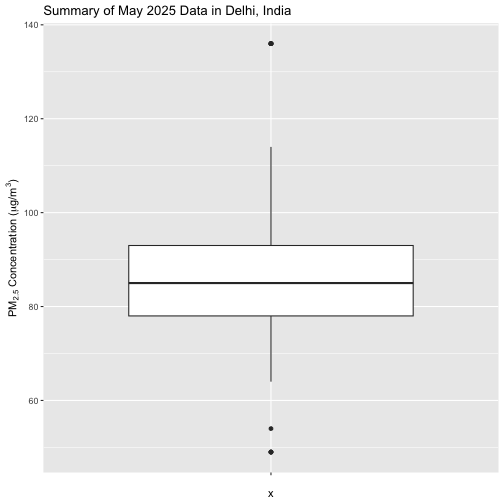
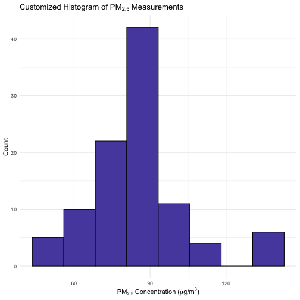

 
The openaq package provides functionality for visualizing data through the
built-in R `base::plot` package (see vignette("plotting")). A popular alternative package
for creating data visualizations is [`ggplot2`](https://ggplot2.tidyverse.org/), known for its declarative API and
ease of use for creating highly customized plots. The `openaq` package 
automatically provides data output as a data frame, making it straightforward to
integrate openaq with `ggplot2`.

To demonstrate how to use `ggplot2` with `openaq`, we will query
PM<sub>2.5</sub> measurement data.

We will query data from sensor 12235029, a PM<sub>2.5</sub> sensor located in
Delhi, India, for May 2025. We make sure specify the correct timezone (Asia/Kolkata) to
ensure we query datetime in the local time of the location.


``` r
pm25_data <- list_sensor_measurements(
  12235029,
  datetime_from = as.POSIXct("2025-05-01", tz = "Asia/Kolkata"),
  datetime_to = as.POSIXct("2025-05-31", tz = "Asia/Kolkata")
)
head(pm25_data)
```

```
##   value parameter_id parameter_name parameter_units period_label
## 1    78            2           pm25           µg/m³          raw
## 2    78            2           pm25           µg/m³          raw
## 3    78            2           pm25           µg/m³          raw
## 4    78            2           pm25           µg/m³          raw
## 5    80            2           pm25           µg/m³          raw
## 6    91            2           pm25           µg/m³          raw
##   period_interval       datetime_from         datetime_to latitude longitude
## 1        00:15:00 2025-05-01 00:45:00 2025-05-01 01:00:00       NA        NA
## 2        00:15:00 2025-05-01 01:00:00 2025-05-01 01:15:00       NA        NA
## 3        00:15:00 2025-05-01 01:15:00 2025-05-01 01:30:00       NA        NA
## 4        00:15:00 2025-05-01 01:30:00 2025-05-01 01:45:00       NA        NA
## 5        00:15:00 2025-05-01 02:30:00 2025-05-01 02:45:00       NA        NA
## 6        00:15:00 2025-05-01 02:45:00 2025-05-01 03:00:00       NA        NA
##   min q02 q25 median q75 q98 max avg sd expected_count expected_interval
## 1  NA  NA  NA     NA  NA  NA  NA  NA NA              1          00:15:00
## 2  NA  NA  NA     NA  NA  NA  NA  NA NA              1          00:15:00
## 3  NA  NA  NA     NA  NA  NA  NA  NA NA              1          00:15:00
## 4  NA  NA  NA     NA  NA  NA  NA  NA NA              1          00:15:00
## 5  NA  NA  NA     NA  NA  NA  NA  NA NA              1          00:15:00
## 6  NA  NA  NA     NA  NA  NA  NA  NA NA              1          00:15:00
##   observed_count observed_interval percent_complete percent_coverage
## 1              1          00:15:00              100              100
## 2              1          00:15:00              100              100
## 3              1          00:15:00              100              100
## 4              1          00:15:00              100              100
## 5              1          00:15:00              100              100
## 6              1          00:15:00              100              100
```


In this exercise, we will demonstrate how to plot both a box plot and a
histogram with `ggplot2`. The plots are common visualizations for exploring air
quality measurement data and will serve as guides for working with `ggplot` and 
`openaq`. A box plot illustrates the distribution of PM<sub>2.5</sub> values in
May 2025. It shows the median, interquartile range, and helps identifies
outliers in the dataset. This chart can help us understand the overall spread
and average levels of particulate matter.

`ggplot2` makes creating this kind of plot easy with it's
`ggplot2::geom_boxplot()` function. Because the data from the `openaq` is
presented in long format and as a data frame we can directly add the data to the
`ggplot2::ggplot()` function for charting. 


``` r
ggplot(pm25_data, aes(x = "", y = value)) +
  geom_boxplot() +
  labs(
    title = "Summary of May 2025 Data in Delhi, India",
    y =  expression("PM"[2.5]~"Concentration ("*mu*"g/m"^3*")")
  ) +
  theme_grey()
```




Now, let's summarize the frequency distribution of PM<sub>2.5</sub> values over
the month. We will use a histogram, for which `ggplot2` provides the
`ggplot2::geom_histogram()` function. To calculate an optimal bin width for the
histogram we can use [Scott's Rule](https://en.wikipedia.org/wiki/Scott%27s_rule),
which adapts to the data spread and size.


``` r
scott_bw <- function(x) {
  (max(x) - min(x)) / nclass.scott(x)
}
```


This histogram provides a quick view of the overall distribution and skew of the
data, highlighting standard value ranges and the presence of high-pollution
events. 


``` r
ggplot(pm25_data, aes(x = value)) +
  geom_histogram(
    binwidth = scott_bw(pm25_data$value)
  ) +
  theme_grey()
```


You can customize your histogram by changing the color and fill as shown
below. This histogram highlights overall distribution and possible high-pollution
events. You can further customize fill color, bins, and themes.


``` r
ggplot(pm25_data, aes(x = value)) +
  geom_histogram(
    binwidth = scott_bw(pm25_data$value),
    fill = "#584DAE", color = "black"
  ) +
  labs(
    title = expression("Customized Histogram of PM"[2.5]~"Measurements"),
    x = expression("PM"[2.5]~"Concentration ("*mu*"g/m"^3*")"),
    y = "Count"
  ) +
  theme_minimal()
```


